# AutoBridge Command Knowledge Graph

**Source:** `autobridge.js` (3,387 lines) — JsMacrosCE WebSocket Bridge for Minecraft 1.21.11
**Total Commands:** ~1,546 (auto-generated from `def()` calls with `{min-max}` expansion)

---

## Mermaid.js Flowchart

```mermaid
graph TD
    root["AutoBridge (1,546 commands)"]

    root --> perceive["perceive.* (224)<br/>Block & Entity Scanning"]
    root --> world["world.* (68)<br/>World Queries"]
    root --> player["player.* (87)<br/>Player State"]
    root --> item["item.* (40)<br/>Item Details"]
    root --> inv["inv.* (113)<br/>Inventory Operations"]
    root --> screen["screen.* (388)<br/>Screen/GUI Control"]
    root --> act["act.* (25)<br/>Player Actions"]
    root --> block["block.* (21)<br/>Block Interaction"]
    root --> nav["nav.* (15)<br/>Navigation"]
    root --> chat["chat.* (8)<br/>Chat System"]
    root --> container["container.* (15)<br/>Container Access"]
    root --> event["event.* (4)<br/>Event System"]
    root --> util["util.* (512+)<br/>Utility (math/string/json/array/random/compare/time/clone/type/..."]

    perceive --> perceive_blocks["perceive.blocks.* (160+)<br/>findBlocks template<br/>Block type scanning in radius"]
    perceive --> perceive_entities["perceive.entity.* (50+)<br/>findEntities template<br/>Entity type scanning"]

    perceive_blocks --> perceive_blocks_utils["chest / furnace / barrel<br/>crafting_table / anvil<br/>hopper / dispenser / dropper<br/>ore / wood / plant / water<br/>bed / door / rail / torch<br/>200+ block variants"]

    perceive_entities --> perceive_entities_types["player / mob_hostile / mob_passive<br/> villager / animal / monster<br/>item_drop / nearest<br/>zombie / skeleton / creeper<br/>spider / enderman / witch<br/>piglin / cow / pig / sheep<br/>30+ entity types"]

    world --> world_queries["world.biome / .time / .weather<br/>.difficulty / .dimension / .spawn<br/>.seed / .moonPhase / .height<br/>.light / .block / .fullBright<br/>.structure / .slimeChunk<br/>isDay / isNight / isRaining<br/>isThundering / getTimeOfDay<br/>getSeaLevel / getTemperature<br/>+ 40 more world state queries"]

    player --> player_state["player.health / .hunger / .xp<br/>.oxygen / .armor / .effects<br/>.gamemode / .abilities / .score<br/>.velocity / .selectedSlot<br/>.name / .uuid / .pos<br/>.yaw / .pitch / .blockPos<br/>isSneaking / isSprinting<br/>isFlying / isOnGround<br/>isInWater / isInLava<br/>+ 50 more player state queries"]

    item --> item_details["item.info / .nbt / .durability<br/>.enchantments / .components<br/>.food / .potion / .full<br/>.repairCost / .rarity<br/>getDisplayName / getTooltip<br/>isEnchantable / isDamageable<br/>getAttackDamage / getAttackSpeed<br/>+ 25 more item detail queries"]

    inv --> inv_slot["inv.slot.{0-40}.get (41)<br/>inv.slot.{0-40}.set (41)"]
    inv --> inv_hotbar["inv.hotbar.{0-8}.get (9)<br/>inv.hotbar.{0-8}.set (9)"]
    inv --> inv_armor["inv.armor.{0-3}.get (4)"]
    inv --> inv_ops["inv.search / .count / .clear<br/>.isEmpty / .firstSlot<br/>.hotbar / .armor / .offhand"]

    screen --> screen_slots["screen.slot.{0-53}.get (54)<br/>containerGet template"]
    screen --> screen_clicks["screen.click.*.slot.{0-53} (324)<br/>6 click types × 54 slots"]
    screen --> screen_actions["screen.getSlots / .getSlot<br/>.getCursor / .getCursorStack<br/>.getSlotCount / .getTitle<br/>.getType / .isOpen / .close<br/>.closeAll / .actionBar<br/>.title / .quickMove / .throwItem<br/>.setCursorStack"]

    act --> act_movement["act.jump / .sprint / .sneak<br/>.stop / .forward / .backward<br/>.strafeLeft / .strafeRight<br/>.fly / .look / .lookAt / .move"]
    act --> act_combat["act.attack / .use / .drop"]
    act --> act_inventory["act.selectSlot.{0-8} (9)<br/>act.swapHands"]

    block --> block_interact["block.activate / .break<br/>.mine / .place / .attack"]
    block --> block_query["block.getState / .getWeakPower<br/>.getStrongPower / .isPowered<br/>.getFluidState / .getCollisionShape<br/>.getOutlineShape / .getBlastResistance<br/>.isSolidBlock / .hasComparatorOutput<br/>.getComparatorOutput / .setBlockState<br/>.getEmittedRedstonePower<br/>.getReceivedRedstonePower"]

    nav --> nav_basic["nav.walkTo / .walkStatus<br/>.cancelWalk / .teleport<br/>.walkToBlock"]
    nav --> nav_advanced["nav.jump / .climb / .swim / .fall<br/>.sneak / .sprint / .lookAt<br/>.facing / .stop / .wander"]

    chat --> chat_commands["chat.send / .command<br/>.history / .clear<br/>.whisper / .say / .tell<br/>.teamMsg"]

    container --> container_ops["container.scan / .search / .count<br/>.extract / .insert / .transfer<br/>.swap / .clear / .getStacks<br/>.isEmpty / .size / .canUse<br/>.markDirty / .brewingInfo<br/>.furnaceInfo"]

    event --> event_ops["event.subscribe / .unsubscribe<br/>.list / .broadcast"]

    util --> util_math["util.math.* (32)<br/>add / sub / mul / div / sum / avg<br/>min / max / clamp / abs / round<br/>floor / ceil / sqrt / pow / log<br/>exp / sin / cos / tan / atan2<br/>dist / dist3d / lerp / normalize<br/>random / randomInt / sign<br/>toRad / toDeg / pi / e"]
    util --> util_string["util.string.* (30)<br/>length / concat / upper / lower<br/>trim / replace / replaceAll / split<br/>join / indexOf / includes / slice<br/>substring / charAt / charCodeAt<br/>startsWith / endsWith / padStart<br/>padEnd / repeat / reverse / count<br/>match / test / isEmpty / format<br/>parseInt / parseFloat / trimStart<br/>trimEnd / normalize / at / fromCharCode"]
    util --> util_json["util.json.* (25+)<br/>parse / parseOrNull / stringify<br/>stringifyPretty / get / has / keys<br/>values / entries / fromEntries<br/>merge / clone / diff / pick / omit<br/>flatten / size / type / isEmpty<br/>mapKeys / mapValues / filter<br/>isArray / isNull / isUndefined<br/>isBoolean / isNumber / isString / isObject"]
    util --> util_array["util.array.* (17)<br/>length / get / first / last / slice<br/>filter / push / pop / shift / unshift<br/>includes / indexOf / join / concat<br/>sort / reverse / every / some"]
    util --> util_random["util.random.* (13)<br/>int / float / boolean / uuid<br/>string / shuffle / choice<br/>weightedChoice / gaussian / range<br/>pickN / coinFlip / dice"]
    util --> util_compare["util.compare.* (8)<br/>eq / neq / gt / gte / lt / lte<br/>identity / deep"]
    util --> util_time["util.time.* (90+)<br/>now / ms / unix / utc / local<br/>sleep / format* (40+ format variants)<br/>add / diff / before / after / between<br/>parse / toTimestamp / fromTimestamp<br/>daysSince / isLeapYear / daysInMonth<br/>dayOfWeek / weekNumber / monthName<br/>dayName / toUTC / toLocal / hours<br/>minutes / seconds / millis / elapsed<br/>countdown / timezone / offset / isDst"]
    util --> util_clone["util.clone* (13)<br/>clone / cloneDeep / cloneShallow<br/>cloneMerge / cloneExtend / cloneAssign<br/>cloneCopy / cloneMove / cloneSwap<br/>cloneReplace / cloneUpdate / clonePatch<br/>cloneDiff"]
    util --> util_type["util.type* / util.is* (140+)<br/>typeof / isArray / isObject / isString<br/>isNumber / isBoolean / isNull / isUndefined<br/>isNaN / isFinite / isEmpty / isEqual<br/>isNumeric / isAlpha / isEmail / isUrl / isIp<br/>isCamelCase / isSnakeCase / isKebabCase<br/>isPrime / isPalindrome / isPowerOfTwo<br/>isUUID / isBase64 / + 100+ type checkers"]
    util --> util_misc["util.base64.encode / .decode<br/>util.type / util.typeof"]
```



---

## Command Flow Architecture

```
WebSocket Client          autobridge.js                 Minecraft Client
───────────────           ──────────────────             ──────────────
                           startBridge()
                              │
                              ├─ loadConfig()
                              ├─ ws.start(host, port)
                              │
ws.send({type, payload})      │
       │                      │
       └──→ onMessage(connId, raw)
                │
                ├─ JSON.parse(raw)
                ├─ Validate: type field present
                ├─ Auth check (if apiKey configured)
                ├─ Rate limit check
                │
                ├─ handler = __bridge.commands.handlers[msg.type]
                │       ↓ (lookup in handler map built from ~1,546 entries)
                │
                └─ _queueCommand(connId, id, type, handler, payload)
                        │
                        └─ _drainQueue()
                              │
                              ├─ mc.execute(function() {
                              │     while (queue.length > 0) {
                              │         cmd = queue.shift()
                              │         result = handler(payload)
                              │         _sendResponse(result)
                              │     }
                              │ })
                              │
                              └─ handler runs on MC client thread
                                    │
                                    ├─ Uses Client.player, Client.world APIs
                                    ├─ Can send network packets (move, look, interact)
                                    ├─ Can read/write inventories, screens, containers
                                    └─ Returns {success, data} or {success, error}
```

---

## Event Broadcasting System

| Event | Interval | Trigger | Broadcast Payload |
|-------|----------|---------|-------------------|
| `position` | Every 200ms | Player moves/yaw/pitch/dimension changes | `{x, y, z, yaw, pitch, onGround, dimension, walking}` |
| `health` | Every tick | Health/food/saturation changes | `{health, maxHealth, food, saturation}` |
| `death` | On death | Player health drops to 0 | `{message, source}` |
| `chat` | On chat | Any chat message received | `{message, sender, timestamp}` |

Broadcast via: `globalThis.__bridge.ws.broadcast('event', {event: type, data: ...})`

---

## Namespace Convention

```
category.subcategory.action

Examples:
  perceive.blocks.chest     → find chest-type blocks
  screen.click.PICKUP.slot.12 → PICKUP click on screen slot 12
  inv.slot.4.get            → get inventory slot 4
  util.math.clamp           → clamp a number
  player.isSneaking         → check if player is sneaking
  act.selectSlot.3          → select hotbar slot 3
  event.subscribe           → subscribe to an event
```

---

## Template Factory Pattern

### Registration Flow

```
def('inv.slot.{0-40}.get', 'invGet', params)
  │
  ├─ ns.split('.') → ['inv', 'slot', '{0-40}', 'get']
  ├─ _expandAll(parts)
  │     └─ _expandRange('{0-40}') → [0,1,2,...,40]
  │
  └─ COMMAND_ENTRIES.push({ns: 'inv.slot.0.get', template: 'invGet'})
     COMMAND_ENTRIES.push({ns: 'inv.slot.1.get', template: 'invGet'})
     ... (41 entries expanded)
     
Then at generation time (line 3021-3091):

  for each COMMAND_ENTRIES:
    tname = entry.template
    if 'findBlocks'  → h = TM.findBlocks(params)
    if 'invGet'      → h = TM.invGet({slot: N})
    if 'screenClick' → h = TM.screenClick({slot: N, actionType, button})
    ...
    __bridge.commands.handlers[entry.ns] = h
```

### Template ↔ Namespace Mapping

| Template Factory | Namespace | Raw def() count | Expanded count | Description |
|---|---|---|---|---|
| `TM.findBlocks` | `perceive.blocks.*` | ~110 | ~160 | Scan blocks by type in configurable radius |
| `TM.findEntities` | `perceive.entity.*` | ~43 | ~45 | Scan entities by type |
| `TM.entityInteract` | `perceive.entity.*` | — | ~4 | Entity interaction handlers |
| `TM.worldQuery` | `world.*` | ~55 | ~68 | World state queries (biome, time, weather, etc.) |
| `TM.playerQuery` | `player.*` | ~73 | ~87 | Player state queries (health, position, flags) |
| `TM.itemDetail` | `item.*` | ~34 | ~40 | Item information (durability, enchantments, components) |
| `TM.invGet` | `inv.slot.{0-40}`, `inv.hotbar.{0-8}`, `inv.armor.{0-3}` | 4 | 54 | Inventory slot reading |
| `TM.invSet` | `inv.slot.{0-40}`, `inv.hotbar.{0-8}` | 3 | 50 | Inventory slot writing |
| `TM.invOps` | `inv.*` | 9 | 9 | Inventory operations (search, count, clear, etc.) |
| `TM.containerGet` | `screen.slot.{0-53}` | 1 | 54 | Open screen slot reading |
| `TM.screenClick` | `screen.click.*.slot.{0-53}` | 6 | 324 | Slot click actions (6 types × 54 slots) |
| `TM.screenAction` | `screen.*` | 10 | 10 | Screen operations (close, getSlots, title, etc.) |
| `TM.playerAction` | `act.*` | 17 | 25 | Player movement/actions + selectSlot expansion |
| `TM.blockAction` | `block.*` | 17 | 21 | Block interaction (break, place, activate, query) |
| `TM.blockQuery` | `world.block` | 1 | 1 | Single block query |
| `TM.nav` | `nav.*` | 12 | 15 | Navigation (walkTo, teleport, climb, swim, etc.) |
| `TM.chat` | `chat.*` | 8 | 8 | Chat commands (send, command, clear, whisper, etc.) |
| `TM.containerAction` | `container.*` | 14 | 15 | Container operations (scan, extract, transfer, etc.) |
| `TM.eventOps` | `event.*` | 4 | 4 | Event subscription/broadcast |
| `TM.utility` | `util.*` | ~300+ | 512+ | Math, string, JSON, array, random, compare, time, type, clone, base64 |
| `TM.scanContainer` | — | — | Inline | Container scanning at specific coordinates |

### Click Action Types (screen.click.*)

| Action | Button | Description |
|--------|--------|-------------|
| `PICKUP` | 0 | Pick up / drop item |
| `QUICK_MOVE` | 0 | Shift-click to move item |
| `SWAP` | 0 | Swap with hotbar slot |
| `THROW` | 0 | Throw/drop item |
| `CLONE` | 2 | Creative clone item |
| `QUICK_CRAFT` | 0 | Quick craft operation |

Each × 54 screen slots = 324 click commands.

---

## Range Expansion Details

The `_expandRange(s)` function converts `{min-max}` syntax into arrays:

| Pattern | Expands to | Count |
|---------|-----------|-------|
| `{0-40}` | 0,1,2,...,40 | 41 |
| `{0-53}` | 0,1,2,...,53 | 54 |
| `{0-8}` | 0,1,2,...,8 | 9 |
| `{0-3}` | 0,1,2,3 | 4 |

Then `_expandAll(parts)` applies this to each dot-separated segment, producing the Cartesian product of expanded segments.

---

## File Structure

```
autobridge.js (3387 lines)
├── Lines 1-24      — Java type imports, globals
├── Lines 25-69     — Command queue system (_cmdQueue, _drainQueue)
├── Lines 70-403    — WebSocket management, auth, status
├── Lines 404-845   — Command registration API (__bridge.commands)
├── Lines 846-887   — Range expansion (_expandRange, _expandAll, def())
├── Lines 888-1885  — Template factories (TM.* = 24 templates)
│     TM.findBlocks / TM.scanContainer / TM.containerGet
│     TM.screenClick / TM.invGet / TM.invSet / TM.moveItem
│     TM.findEntities / TM.entityInteract / TM.worldQuery
│     TM.playerQuery / TM.itemDetail / TM.utility
│     TM.playerAction / TM.blockAction / TM.nav
│     TM.screenAction / TM.chat / TM.containerAction
│     TM.blockQuery / TM.eventOps / TM.invOps
├── Lines 1886-3020 — Command definitions (def() calls for all namespaces)
├── Lines 3021-3096 — Command generation loop (COMMAND_ENTRIES → handler map)
├── Lines 3098-3169 — Config, logging, rate limiting
├── Lines 3170-3304 — Message handling (_handleMessage) + event broadcast
├── Lines 3305-3387 — Chat handler, start/stop bridge, shutdown hook
```

---

## Total Command Breakdown by Category

| Category | Count | % of Total |
|----------|-------|-----------|
| `util.*` (type checks, math, string, json, array, time, random, compare, clone, base64) | ~512 | 33.1% |
| `screen.*` (slots + clicks + actions) | ~388 | 25.1% |
| `perceive.*` (blocks + entities) | ~224 | 14.5% |
| `inv.*` (slots + operations) | ~113 | 7.3% |
| `player.*` | ~87 | 5.6% |
| `world.*` | ~68 | 4.4% |
| `item.*` | ~40 | 2.6% |
| `act.*` | ~25 | 1.6% |
| `block.*` | ~21 | 1.4% |
| `nav.*` | ~15 | 1.0% |
| `container.*` | ~15 | 1.0% |
| `chat.*` | ~8 | 0.5% |
| `event.*` | ~4 | 0.3% |
| **Total** | **~1,546** | **100%** |
